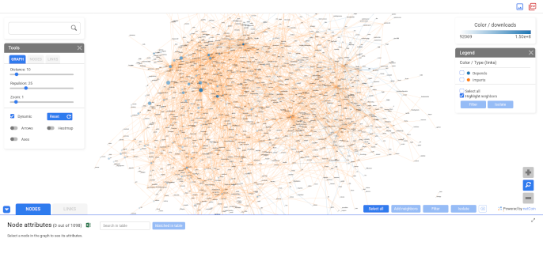
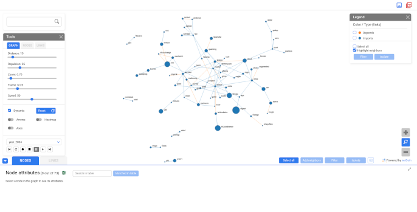

# Visual Analytics Networks with rD3plot

## Description

The `rD3plot` package represents and manages information from a database over a network. It also allows visualization of the temporal evolution or periodic changes of the added elements.

Components:

- **Nodes/Links:** Shapes, Images, Links.
- **Information:** Table, Name, Tooltip, Information Window.
- **Utilities:** Node Search, Filter, Display Customization, Playback Controls, Bar Charts.

## Examples

Load rD3plot library and example data with the dependencies network of CRAN packages
It loads 2 data.frames: links and nodes
```{r}
library(rD3plot)
data("crannetworkdata")
links <- crannetworkdata$links
nodes <- crannetworkdata$nodes
```

Simple network creation. Columns with edge color, node size, node color and node information are specified for network customization.
```{r message=FALSE, warning=FALSE}
net <- network_rd3(links=links, nodes=nodes, lcolor="Type", size="downloadsyear",
  info="info", color="downloads", dir="CRANnetwork")
plot(net)
```

```{r echo=FALSE}

```

Evolving CRAN network creation
```{r message=FALSE, warning=FALSE}
# It is necessary the creation of a list of networks
nets <- list()
# Each network, delimited by time, will be a frame
for(t in (min(links$Year):max(links$Year))){
    sublinks <- links[links$Year<=t,]
    nets[[paste0("year_",t)]] <- network_rd3(links=sublinks, nodes=nodes, lcolor="Type",
      size="downloads", info="info")
}
# Join this networks in a evolutive network with the `evolNetwork_rd3` function
net <- evolNetwork_rd3(nets, dir="CRANnetworkEvol")
plot(net)
```

```{r echo=FALSE}

```
